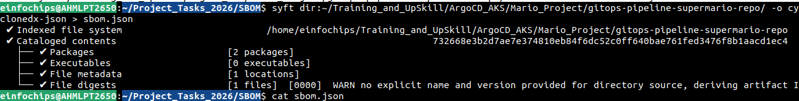
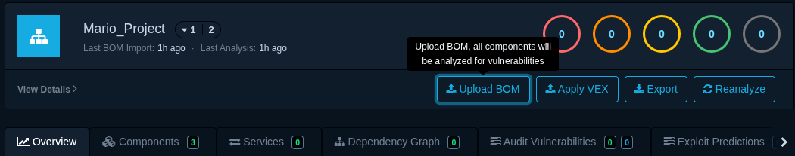
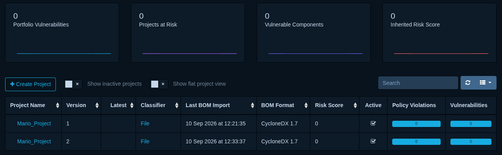

SBOM
---

## 1. Setup Dependency Track

### 1. Create dir

```bash
mkdir dependency-track && cd dependency-track
```

### 2. Download dependency track docker compose file

```bash
curl -LO https://dependencytrack.org/docker-compose.yml

docker compose up -d
```

- Access Dependency Track on port 8081.

- Setup your new passwd.

- This will deploy two images `dependencytrack/apiserver` (the Java API server) and `dependencytrack/frontend` (the Vue.js UI)`.

## 2. Generate SBOMs

- Generate SBOMs with tools lke Syft, CycloneDX CLI

- To generate SBOMs you would rquire to install syft first from official docs

[syft install](https://oss.anchore.com/docs/installation/syft/)

```bash
# Generate SBOM with Syft
# Syft binaries are provided for Linux, macOS and Windows.


curl -sSfL https://get.anchore.io/syft | sudo sh -s -- -b /usr/local/bin

# Installation script options
# -b: Specify a custom installation directory (defaults to ./bin)
# -d: More verbose logging levels (-d for debug, -dd for trace)
# -v: Verify the signature of the downloaded artifact before installation
```

- Create SBOM to list all project's dependencies

- Generate SBOM using cyclonedx Std

- There are 2 Std of SBOMs. 1. Cyclonedx, 2. SPDX

- We will generate SBOMs in a `json` formate.

- We can generate SBOMs in a `json` and `xml`.

- `Cyclonedx` is more centric on `Security`.
- `SPDX` is more centric on `complience`.

- You can gererate SBOMs using syft, gryps, sonotype

```bash
syft dir:~/Training_and_UpSkill/ArgoCD_AKS/Mario_Project/gitops-pipeline-supermario-repo/ -o cyclonedx-json > sbom.json
```

- It will create `sbom.json` file




## 3. Uload SBOM report to Dependency Tracker

- Go to Project > Create Project > Click on Upload BOM.






