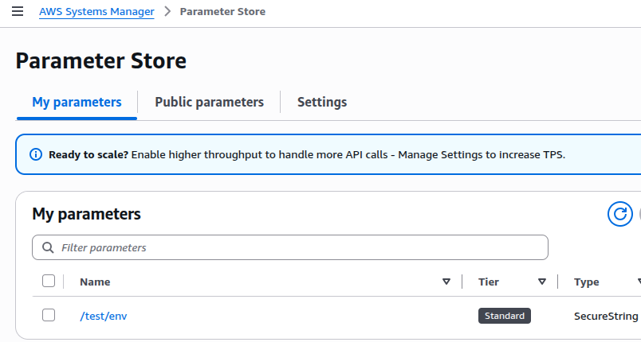
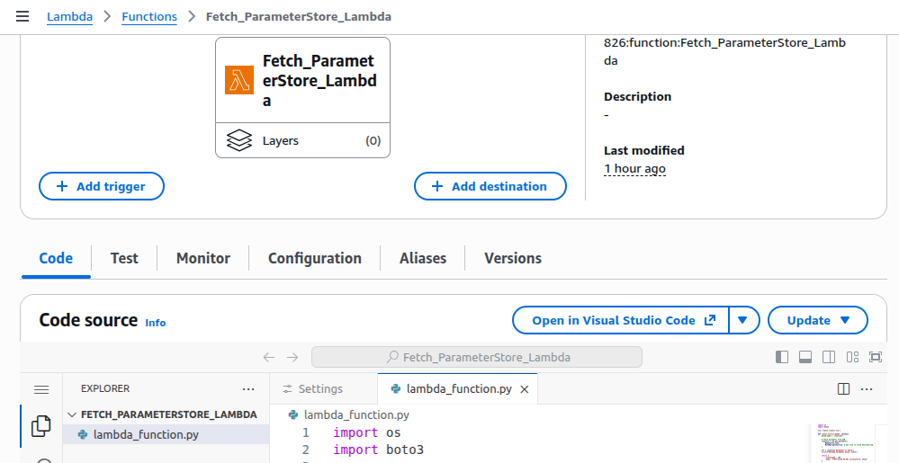

SSM Parameter Store will use by Lambda
---

### Step 1: Create SSM Parameter store

- Create Sample parameter store

- Create secrets in parameter store named `/test/env`, add value `test`.

- Choose one of Type: `String`, `StringList`, `SecureString`.



### Step 2: Create IAM Policy to fetch parameter store by lambda

- Allow lambda to fetch or get secrets from paramete store.

- Create policy and attach to lambda execution role.

```json
{
    "Version": "2012-10-17",
    "Statement": [
        {
            "Effect": "Allow",
            "Action": [
                "ssm:GetParameter",
                "ssm:GetParameters"
            ],
            "Resource": "arn:aws:ssm:us-east-2:<Acc_Number>:parameter/test/env/*"
        }
    ]
}
```

### Step 3: Create lambda function



- Create test env to pass 


